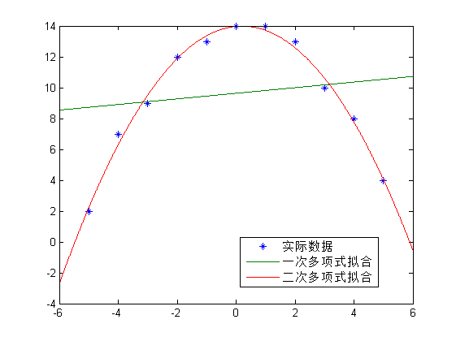

#作业4

> 姓名：张乐，学号：201628013229047

## **6**
$$
\begin{aligned}
\mathbf{A}&=
\begin{pmatrix}
1 & 3 & 1 & -4 \\
-1 & -3 & 1 & 0 \\
2 & 6 & 2 & -8
\end{pmatrix}\\
&\sim
\begin{pmatrix}
1 & 3 & 0 & -2 \\
0 & 0 & 1 & -2 \\
0 & 0 & 0 & 0
\end{pmatrix}\\
rank(\mathbf A)&=2\\
\mathbf{A^TA}&=
\begin{pmatrix}
1 & -1 & -2 \\
3 & -3 & 6 \\
1 & 1 & 2 \\
-4 & 0 & 8
\end{pmatrix}
\begin{pmatrix}
1 & 3 & 1 & -4 \\
-1 & -3 & 1 & 0 \\
2 & 6 & 2 & -8
\end{pmatrix}\\
&=
\begin{pmatrix}
6 & 18 & 4 & -20 \\
18 & 54 & 12 & -60 \\
4 & 12 & 6 & -20\\
-20&-60&-20&80\\
\end{pmatrix}\\
&\sim
\begin{pmatrix}
1  &   3   &  0  &  -2 \\
0  &   0   &  1  &  -2 \\
0  &   0   &  0  &   0 \\
0  &   0   &  0  &   0
\end{pmatrix}\\
rank(\mathbf{A^TA})&=2\\
\mathbf{AA^T}&=
\begin{pmatrix}
1 & 3 & 1 & -4 \\
-1 & -3 & 1 & 0 \\
2 & 6 & 2 & -8
\end{pmatrix}
\begin{pmatrix}
1 & -1 & -2 \\
3 & -3 & 6 \\
1 & 1 & 2 \\
-4 & 0 & 8
\end{pmatrix}\\
&=
\begin{pmatrix}
27  &  -9  &  54\\
-9  &  11  & -18\\
54  & -18  & 108
\end{pmatrix}\\
&\sim
\begin{pmatrix}
1  &   0  &   2\\
0  &   1  &   0\\
0  &   0  &   0\\
\end{pmatrix}\\
rank(\mathbf{AA^T})&=2\\
\end{aligned}
$$
所以
$$
rank(\mathbf{A})=rank(\mathbf{A^TA})=rank(\mathbf{AA^T})=2\\
$$

## **9**

> 最小二乘法拟合有公式
> $$\mathbf{A^TAx}=\mathbf{A^Tb}$$
> 其中 
> $$
\mathbf{A}=
\begin{pmatrix}
1 & 1 & 1 & \ldots \\
t_1 & t_2 & t_3 & \ldots \\
t_1^2 & t_2^2 & t_3^2 & \ldots \\
\vdots & \vdots & \vdots & \ddots
\end{pmatrix}^T
$$
>误差$$
err=(\mathbf{Ax}-\mathbf{b})^T(\mathbf{Ax}-\mathbf{b})
$$

对于用一次多项式拟合有

$$
\begin{aligned}
\mathbf{A}&=
\begin{pmatrix}
 1  &   1  &   1   &  1   &  1  &   1  &   1  &   1   &  1   &  1  &   1\\
-5  &  -4  &  -3   & -2   & -1  &   0  &   1  &   2   &  3   &  4  &   5\\
\end{pmatrix}^T\\
\mathbf{b}&=
\begin{pmatrix}
 2  &   7  &   9   &  12   &  13  &   14  &   14  &   13   &  10   &  8  &   4\\
\end{pmatrix}^T\\
\mathbf{x}&=(\mathbf{A^TA})^{-1}\mathbf{A^Tb}\\
&=\begin{pmatrix}   9.6364  &  0.1818 \end{pmatrix}^T
\end{aligned}
$$
对应的拟合多项式为
$$
\hat{y}=0.1818+9.6364x
$$

误差
$$
\begin{aligned}
err_1&=(\mathbf{Ax}-\mathbf{b})^T(\mathbf{Ax}-\mathbf{b})\\
&=162.9091
\end{aligned}
$$

对于用二次多项式拟合有

$$
\begin{aligned}
\mathbf{A}&=
\begin{pmatrix}
 1  &   1  &   1   &  1   &  1  &   1  &   1  &   1   &  1   &  1  &   1\\
-5  &  -4  &  -3   & -2   & -1  &   0  &   1  &   2   &  3   &  4  &   5\\
25  &  16  &   9   &  4   &  1  &   0  &   1  &   4   &  9   & 16  &  25\\
\end{pmatrix}^T\\
\mathbf{b}&=
\begin{pmatrix}
 2  &   7  &   9   &  12   &  13  &   14  &   14  &   13   &  10   &  8  &   4\\
\end{pmatrix}^T\\
\mathbf{x}&=(\mathbf{A^TA})^{-1}\mathbf{A^Tb}\\
&=\begin{pmatrix}   13.9720  &  0.1818  & -0.4336 \end{pmatrix}^T
\end{aligned}
$$
对应的拟合多项式为
$$
\hat{y}=-0.4336+0.1818x+13.9720x^2
$$

误差
$$
\begin{aligned}
err_2&=(\mathbf{Ax}-\mathbf{b})^T(\mathbf{Ax}-\mathbf{b})\\
&=1.6224
\end{aligned}
$$

	

$err_1>err_2$并且从示意图也可以清晰看出二次拟合效果更好

