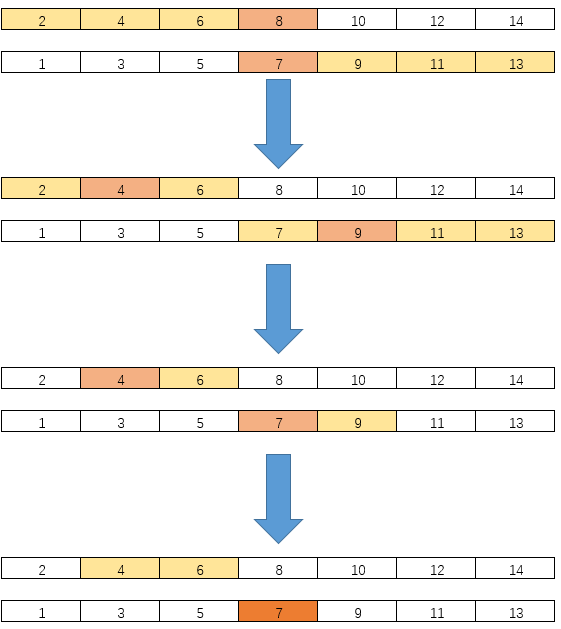
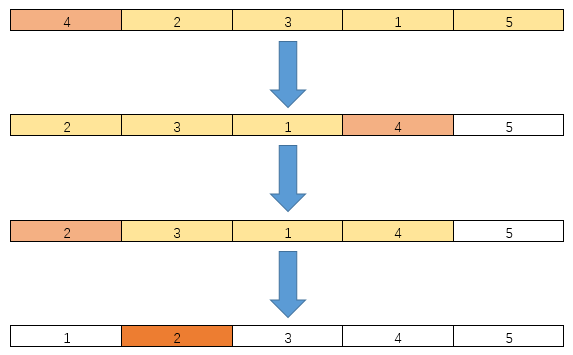
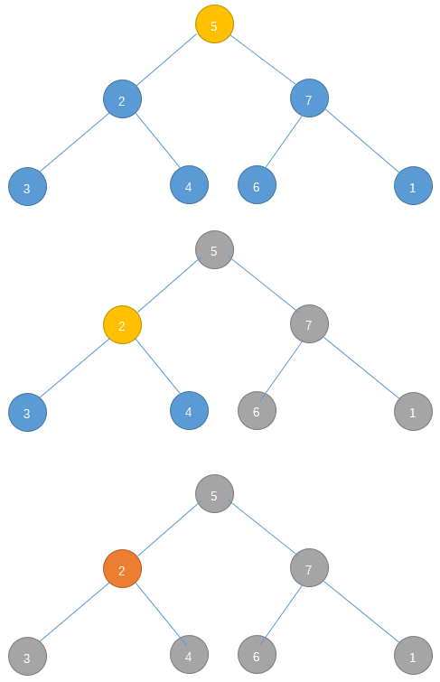

# Homework 1

> Student Name: ZhangLe(张乐)
>
> Student ID: 201628013229047

I choose question 1,2,3 and question 8,10. In addition, I complete question 11. I implement all solution of homework in `C`

## Question 1

> You are interested in analyzing some hard-to-obtain data from two separate databases. Each database contains $n$ numerical values, so there are $2n$ values total and you may assume that no two values are the same. You'd like to determine the median of this set of $2n$ values, which we will define here to be the $n^{th}$ smallest value.
> 
> However, the only way you can access these values is through $queries$ to the databases. In a single query, you can specify a value $k$ to one of the two databases, and the chosen database will return the $k^{th}$ smallest value that it contains. Since queries are expensive, you would like to compute the median using as few queries as possible.
> 
> Give an algorithm that finds the median value using at most $O(\log n)$ queries.

### Idea

Assume $A$ and $B$ are two databases, elements in $A$ and $B$ are sorted.

We can get median val from each database, assume $a$ and $b$. 
If $a>b$, find median in $A[1,\frac{n}{2}]$ and $B[\frac{n}{2}+1,n]$, otherwise, find median in $A[\frac{n}{2}+1,n]$ and $B[1,\frac{n}{2}]$

#### Pseudo Code

```pseudo
findMedianHelper(A[0...n-1],B[0...n-1)
    if(A and B only have one element)
        return MIN(A,B)
    
    query A and B median element index, assume a and b.
    
    if(A[a]>B[b])
        return findMedianHelper(A[0...a],B[b+1...n-1])
    else
        return findMedianHelper(A[a+1...n-1],B[0...b])
```

### Subproblem reduction graph



### Provement

Firstly, we always make each database smaller than before(about half size), so after finite step we can finish.

Secondly, we can always find $k^{th}$ element in each partition. So when the partition size turn to one, the smaller element is the result.

### Complexity

For function called each time, question reduce to half size, so $T(n)=T(\frac{n}{2})+c \Rightarrow T(n)=O(log(n))$

### Implementation

nth-smallest.h

```c
//
// Created by zl on 2016/9/29.
//

#ifndef WORKSPACE_NTH_SMALLEST_H
#define WORKSPACE_NTH_SMALLEST_H

int findMedian(int *a, int *b, int size);

#endif //WORKSPACE_NTH_SMALLEST_H

```


nth-smallest.c

```c
//
// Created by zl on 2016/9/29.
//

#include "nth-smallest.h"

#define min(a, b) ((a)<(b)?(a):(b))
#define max(a, b) ((a)>(b)?(a):(b))

/**
 *
 * @param a A sorted array
 * @param ab The begin element index of a
 * @param ae The end element index of a
 * @param b A sorted array
 * @param bb The begin element index of b
 * @param be The end element index of b
 * @return The median element
 */
int findMedianHelper(int *a, int ab, int ae, int *b, int bb, int be) {
    if (ab == ae && bb == be) {
        return min(a[ab], b[bb]);
    }

    int am = (ab + ae) / 2;
    int bm = (bb + be) / 2;

    if (a[am] > b[bm]) {
        return findMedianHelper(a, ab, am, b, bm + 1, be);
    } else {
        return findMedianHelper(a, am + 1, ae, b, bb, bm);
    }
}

/**
 *
 * @param a A sorted array
 * @param b A sorted array
 * @param size Size of a and b
 * @return The median element
 */
int findMedian(int *a, int *b, int size) {
    return findMedianHelper(a, 0, size - 1, b, 0, size - 1);
}

```
main.c

```c
//
// Created by zl on 2016/9/24.
//

#include "stdio.h"
#include "stdlib.h"
#include "time.h"
#include "multiplication.h"
#include "matrix-multi.h"
#include "inversion-number.h"
#include "kthLargest.h"
#include "tree-local-min.h"
#include "nth-smallest.h"

#define DIM         512
#define BUFFER_SIZE ((DIM)*(DIM))
int arr[BUFFER_SIZE];

int main() {

    int a[] = {1, 2, 7, 10, 11, 12};
    int b[] = {0, 3, 5, 14, 15, 16};
    int res = findMedian(a, b, 5);
    printf("%d", res); //res is 7
    return 0;
}
```
## Question 2

> Find the $k^{th}$ largest element in an unsorted array. Note that it is the $k$th largest element in the sorted order, not the $k^{th}$ distinct element.
> 
> INPUT: An unsorted array $A$ and $k$.
> 
> OUTPUT: The $k^{th}$ largest element in the unsorted array $A$.

### Idea

Use quick-sort idea, find a pivot then make left side smaller than pivot and right side bigger than it.

In this question we can transform it to a equivalent question: find $s$th smallest element ($s=size-k$) (index begin from 0)

We can get pivot's position(index) easily. if position(index) smaller then $s$, we can find $(s-index-1)^{th}$ smallest in left part.
if position(index) smaller then $s$, find $s^{th}$ smallest in right part.
if position(index) equal $s$, return current element.

#### Pseudo Code

```Pseudo
kthLargest(A[0...n-1],kth)
    return kthMin(A,n-kth)
    
kthMin(A[b...e],kth)
    if(b == e)
        return A[b]
    p = arr[b];
    make A[b...e] that A[b...i]<A[i]=p<A[i+1..e]
    if(i-b<kth)
        return kthMin(A[i+1...end], kth - (i - b + 1))
    if(i-b>kth)
        return kthMin(A[b..i-1],kth)
```

### Subproblem reduction graph



### Provement

Firstly, we always make array smaller than before, so after finite step we can finish.

Secondly, any time when we recursion, we transform question to smaller question in the same form, whose result is equal to origin one.

So, this idea is correct.

### Complexity

- **Worst-case:** pivot is the largest or smallest element.$T(n) \le T(n-1)+cn \Rightarrow T(n)=O(n^2)$
- **Best-case:** pivot divide array into two part which is same size $T(n) \le T(\frac{n}{2})+cn \Rightarrow T(n)=O(n)$
- **Most cases:** same to quick-sort, wo can prove $T(n)=O(n)$ easily.

### Implementation

kthLargest.h

```c
//
// Created by zl on 2016/9/26.
//

#ifndef WORKSPACE_KTHLARGEST_H
#define WORKSPACE_KTHLARGEST_H

int kthLargest(int *arr, int size,int kth);

#endif //WORKSPACE_KTHLARGEST_H

```

kthLargest.c

```c
//
// Created by zl on 2016/9/26.
//

#include "kthLargest.h"

/**
 * Implementation of finding kth min in unsort array, using quick-sort idea
 * @param arr array of number
 * @param begin begin index of array
 * @param end end index of array
 * @param kth kth min
 * @return kth min element value in arr
 */
int kthMinHelper(int *arr, int begin, int end, int kth) {

    if (begin == end) {
        return arr[begin];
    }
    int p = arr[begin];
    int i = begin;
    int j = end;

    while (i != j) {
        while (i != j && arr[j] >= p) j--;
        arr[i] = arr[j];
        while (i != j && arr[i] < p) i++;
        arr[j] = arr[i];

    }
    arr[i] = p;

    if (i - begin < kth) {
        return kthMinHelper(arr, i + 1, end, kth - (i - begin + 1));
    }
    if (i - begin > kth) {
        return kthMinHelper(arr, begin, i - 1, kth);
    }
    return p;

}

/**
 * entry of find kth largest
 * @param arr array of number
 * @param size size of array
 * @param kth kth large element value in array
 * @return
 */
int kthLargest(int *arr, int size, int kth) {
    // kth largest eq to size-kth min (begin from 0)
    return kthMinHelper(arr, 0, size - 1, size - kth);

}


```

main.c

```c
//
// Created by zl on 2016/9/24.
//

#include "stdio.h"
#include "stdlib.h"
#include "multiplication.h"
#include "matrix-multi.h"
#include "inversion-number.h"
#include "kthLargest.h"
#include "tree-local-min.h"

#define BUFFER_SIZE (1000*1000)
int arr[BUFFER_SIZE];

int main() {

    int arr[] = {3, 2, 5, 8, 6, 1};
    //sorted   : 1, 2, 3, 5 ,6, 8
    printf("%d", kthLargest(arr, 6, 6));
    return 0;
    
}
```
    
## Question 3

> Consider an $n$-node complete binary tree $T$, where $n=2^d-1$ for some $d$. Each node $v$ of $T$ is labeled with a real number $x_v$. You may assume that the real numbers labeling the nodes are all distinct. A node $v$ of $T$ is a $local\ minimum$ if the label $x_v$ is less than the label $x_w$ for all nodes $w$ that are joined to $v$ by an edge.
> 
> You are given such a complete binary tree $T$, but the labeling is only specified in the following $implicit$ way: for each node $v$, you can determine the value $x_v$ by $probing$ the node $v$. Show how to find a local minimum of $T$ using only $O(\log n)\ probes$ to the nodes of $T$.

### Idea

Think about a tree, if its root smaller than tow children, itself is local minimum.
  
If root has one or more children smaller then it, we can think the child as a tree, which must have local minimum.
  
#### Pseudo Code

```pseudo
findTreeLocalMin(node)
    if(node don't have child OR its all children value bigger than node.val)
        return node.val
    assume node's child i.val > node.val
    return findTreeLocalMin(i)
         
```

### Subproblem reduction graph



### Provement

Firstly, we always make tree smaller than before(half), so after finite step we can finish.

Secondly,If root has one or more children smaller then it, its subtree must have local minimum node. So, we can find it in its subtree.

### Complexity

For each level in tree, we only visit one time, so $T(n)=T(\frac{n}{2})+c \Rightarrow T(n)=O(log(n))$

### Implementation

tree-local-min.h

```c
//
// Created by zl on 2016/9/26.
//

#ifndef WORKSPACE_TREE_LOCAL_MIN_H
#define WORKSPACE_TREE_LOCAL_MIN_H

typedef struct tagNode {
    int val;
    struct tagNode *left;
    struct tagNode *right;
} Node;
typedef Node Tree;

int findTreeLocalMin(Tree *tree);

#endif //WORKSPACE_TREE_LOCAL_MIN_H

```

tree-local-min.c

```c
//
// Created by zl on 2016/9/26.
//

#include "tree-local-min.h"

#include "stdlib.h"

int findTreeLocalMin(Tree *tree) {
    if (tree->left == NULL && tree->right == NULL) {
        return tree->val;
    }
    if (tree->left->val > tree->val && tree->right->val > tree->val) {
        return tree->val;
    }
    if (tree->left->val < tree->val) {
        return findTreeLocalMin(tree->left);
    }
    return findTreeLocalMin(tree->right);
}

```

main.c

```c
//
// Created by zl on 2016/9/24.
//

#include "stdio.h"
#include "stdlib.h"
#include "multiplication.h"
#include "matrix-multi.h"
#include "inversion-number.h"
#include "kthLargest.h"
#include "tree-local-min.h"

#define BUFFER_SIZE (1000*1000)
int arr[BUFFER_SIZE];

int main() {

    // Tree =
    //             5
    //           /   \
    //          2     7
    //         / \   / \
    //        3   4 6   1
    //
    Node n1 = {
            .left=NULL,
            .right=NULL,
            .val=1
    }, n6 = {
            .left=NULL,
            .right=NULL,
            .val=6
    }, n4 = {
            .left=NULL,
            .right=NULL,
            .val=4
    }, n3 = {
            .left=NULL,
            .right=NULL,
            .val=3
    };

    Node n2 = {
            .left=&n3,
            .right=&n4,
            .val=2
    }, n7 = {
            .left=&n6,
            .right=&n1,
            .val=7
    };

    Node n5 = {
            .left=&n2,
            .right=&n7,
            .val=5
    };

    Tree *tree = &n5;

    printf("%d", findTreeLocalMin(tree));

    return 0;
}
```

## Question 8

> The attached file Q8.txt contains 100,000 integers between 1 and 100,000 (each row has a single integer), the order of these integers is random and no integer is repeated.
>
> 1. Write a program to implement the Sort-and-Count algorithms in your favorite language, find the number of inversions in the given file.
> 
> 2. In the lecture, we count the number of inversions in $O(n log n)$ time, using the Merge-Sort idea. Is it possible to use the Quick-Sort idea instead? If possible, implement the algorithm in your favourite language, run it over the given file, and compare its running time with the one above. If not, give a explanation.

### Merge-sort idea implementation

inversion-number.h

```c
//
// Created by zl on 2016/9/25.
//

#ifndef WORKSPACE_INVERSION_NUMBER_H
#define WORKSPACE_INVERSION_NUMBER_H

long mergeSortInversion(int *arr, int size);

long baseInversion(int *arr, int size);

#endif //WORKSPACE_INVERSION_NUMBER_H


```

inversion-number.c

```c
//
// Created by zl on 2016/9/25.
//

#include <stdlib.h>
#include "inversion-number.h"

/**
 * Number of inversions merge-sort idea implementation
 * @param arr
 * @param begin
 * @param end
 * @return
 */
long mergeSort(int *arr, int begin, int end) {
    if (begin == end) {
        return 0;
    }
    int p = (begin + end) / 2;
    long il = mergeSort(arr, begin, p);
    long ir = mergeSort(arr, p + 1, end);

    int ls = p - begin + 1;
    int rs = end - p;
    int s = ls + rs;
    int *tmp = malloc(sizeof(int) * (s));

    int i = 0;
    int j = 0;
    int k = 0;
    long inv = 0;
    while (i < ls && j < rs) {
        if (arr[i + begin] > arr[j + p + 1]) {
            tmp[k++] = arr[j + p + 1];
            j++;
            // important! count the number of inversion
            inv += ls - i;
        } else {
            tmp[k++] = arr[i + begin];
            i++;
        }
    }
    while (i < ls) { tmp[k++] = arr[begin + i++]; }
    while (j < rs) { tmp[k++] = arr[p + 1 + j++]; }
    for (int t = begin; t <= end; t++) {
        arr[t] = tmp[t - begin];
    }
    free(tmp);
    return il + ir + inv;
}

/**
 * entry of count the number of inversions, using merge-sort idea
 * @param arr input, array of unsort number
 * @param size size of input array
 * @return inversion number
 */
long mergeSortInversion(int *arr, int size) {
    return mergeSort(arr, 0, size - 1);
}

/**
 * base algorithm count the number of inversions, validate result only
 * @param arr input, array of unsort number
 * @param size size of input array
 * @return inversion number
 */
long baseInversion(int *arr, int size) {
    long re = 0;
    for (int i = 1; i < size; i++) {
        for (int j = 0; j < i; j++) {
            if (arr[j] > arr[i]) {
                re++;
            }
        }
    }
    return re;
}


```

main.c

```c
//
// Created by zl on 2016/9/24.
//

#include "stdio.h"
#include "stdlib.h"
#include "multiplication.h"
#include "matrix-multi.h"
#include "inversion-number.h"
#include "kthLargest.h"
#include "tree-local-min.h"

#define BUFFER_SIZE (1000*1000)
int arr[BUFFER_SIZE];

int main() {

    FILE *file = fopen("D:\\\\Q8.txt", "r");
    int size = 0;
    while (EOF != fscanf(file, "%d", arr + size)) {
        size++;
    };

    long invNum = mergeSortInversion(arr, size);

    //reuslt is 2500572073
    printf("%ld", invNum);

    return 0;
}
```

### Is it possible to use the Quick-Sort idea instead?

The question is **No**, merge-sort is stable, but quick-sort is not stable.

But, if we change quick-sort to stable form, it can count the number of inversion.

Following is implementation
  
```c
//
// Created by zl on 2016/9/24.
//

#include "stdio.h"
#include "stdlib.h"
#include "time.h"
#include "multiplication.h"
#include "matrix-multi.h"
#include "inversion-number.h"
#include "kthLargest.h"
#include "tree-local-min.h"
#include "nth-smallest.h"

int *tmp = NULL;

long quickSort(int *arr, int begin, int end) {
    if (begin >= end) {
        return 0;
    }
    long v = 0, lv, rv, vi = 0;
    int pi = begin;

    int p = arr[begin];
    for (int i = begin; i <= end; i++) {
        if (arr[i] < p) pi++;
    }

    tmp[pi] = p;

    int ir = pi + 1, il = begin;

    for (int i = begin + 1; i <= end; i++) {
        if (arr[i] > p) {
            tmp[ir++] = arr[i];
            vi++;
            if (i < begin) v++;
        } else if (arr[i] < p) {
            tmp[il++] = arr[i];
            if (i > begin) v++;
            v += vi;
        }
    }

    for (int i = begin; i <= end; i++) {
        arr[i] = tmp[i];
    }
    lv = quickSort(arr, pi + 1, end);
    rv = quickSort(arr, begin, pi - 1);
    return lv + rv + v;

}

long quickSortInversion(int *arr, int size) {
    tmp = malloc(sizeof(int) * size);
    long result = quickSort(arr, 0, size - 1);
    free(tmp);
    return result;
}

    FILE *file = fopen("D:\\\\Q8.txt", "r");
    int size = 0;
    while (EOF != fscanf(file, "%d", arr + size)) {
        size++;
    };

    long invNum = quickSortInversion(arr, size);

    printf("%ld", invNum);
    
    return 0;
    
}
```

## Question 10

>Implement the Strassen algorithm algorithm for MatrixMultiplication problem in your favourite language, and compare the performance with grade-school method.

### Implementation

matrix-multi.h

```c
//
// Created by zl on 2016/9/25.
//

#ifndef WORKSPACE_MATRIX_MULTI_H
#define WORKSPACE_MATRIX_MULTI_H

int *strassenMatrixMulti(int *a, int *b, int size);

int *baseMatrixAdd(int *a, int *b, int m, int n);

int *baseMatrixSub(int *a, int *b, int m, int n);

int *baseMatrixMulti(int *a, int am, int an, int *b, int bm, int bn);

int **partitionMatrix(int *m, int size);

int *combineMatrix(int *a, int *b, int *c, int *d, int size);

void printMatrix(int *a, int m, int n);

#endif //WORKSPACE_MATRIX_MULTI_H

```

matrix-multi.c

```c
//
// Created by zl on 2016/9/25.
//

#include <stdlib.h>
#include <stdio.h>
#include <memory.h>
#include "matrix-multi.h"

/**
 *
 * @param a A matrix
 * @param b A matrix
 * @param size size of a and b which should be 2^n
 * @return
 */
int *strassenMatrixMulti(int *a, int *b, int size) {

    if (size == 1) {
        int *res = malloc(sizeof(int));

        *res = *a * *b;
        return res;
    }
    int h = size / 2;

    int **ar = partitionMatrix(a, size);
    int **br = partitionMatrix(b, size);

    int *aa = ar[0],
            *ab = ar[1],
            *ac = ar[2],
            *ad = ar[3],
            *ba = br[0],
            *bb = br[1],
            *bc = br[2],
            *bd = br[3];

    int
    //p1=aa(bb-bd)
            *p1 = strassenMatrixMulti(aa, baseMatrixSub(bb, bd, h, h), h),
    //p2=(aa+ab)bd
            *p2 = strassenMatrixMulti(baseMatrixAdd(aa, ab, h, h), bd, h),
    //p3=(ac+ad)ba
            *p3 = strassenMatrixMulti(baseMatrixAdd(ac, ad, h, h), ba, h),
    //p4=ad(bc-ba)
            *p4 = strassenMatrixMulti(ad, baseMatrixSub(bc, ba, h, h), h),
    //p5=(aa+ad)(ba+bd)
            *p5 = strassenMatrixMulti(baseMatrixAdd(aa, ad, h, h), baseMatrixAdd(ba, bd, h, h), h),
    //p6=(ab-ad)(bc+bd)
            *p6 = strassenMatrixMulti(baseMatrixSub(ab, ad, h, h), baseMatrixAdd(bc, bd, h, h), h),
    //p7=(aa-ac)(ba+bb)
            *p7 = strassenMatrixMulti(baseMatrixSub(aa, ac, h, h), baseMatrixAdd(ba, bb, h, h), h);


    return combineMatrix(
            baseMatrixAdd(baseMatrixSub(baseMatrixAdd(p5, p4, h, h), p2, h, h), p6, h, h),
            baseMatrixAdd(p1, p2, h, h),
            baseMatrixAdd(p3, p4, h, h),
            baseMatrixSub(baseMatrixSub(baseMatrixAdd(p1, p5, h, h), p3, h, h), p7, h, h), h
    );
}

/**
 *
 * @param a matrix a which is squre
 * @param b matrix b which is squre
 * @param c matrix c which is squre
 * @param d matrix d which is squre
 * @param size size of a,b,c,d
 * @return
 */
int *combineMatrix(int *a, int *b, int *c, int *d, int size) {

    int h = size;
    size *= 2;
    int *res = malloc(sizeof(int) * size * size);

    for (int i = 0; i < size; i++) {
        for (int j = 0; j < size; j++) {
            if (i < h) {

                if (j < h) {
                    // A
                    res[i * size + j] = a[i * h + j];
                } else {
                    // B
                    res[i * size + j] = b[i * h + j - h];
                }
            } else {

                if (j < h) {
                    // C
                    res[i * size + j] = c[(i - h) * h + j];
                } else {
                    // D
                    res[i * size + j] = d[(i - h) * h + j - h];
                }
            }

        }
    }
    return res;
}

/**
 *
 * @param m the matrix which is squre
 * @param size size of matrix
 * @return pointer to array of matrix
 */
int **partitionMatrix(int *m, int size) {

    int h = size / 2;

    int **res = malloc(sizeof(int *) * 4);

    for (int i = 0; i < 4; i++) {
        res[i] = malloc(sizeof(int) * h * h);
    }

    for (int i = 0; i < size; i++) {
        for (int j = 0; j < size; j++) {
            if (i < h) {

                if (j < h) {
                    // A
                    res[0][i * h + j] = m[i * size + j];
                } else {
                    // B
                    res[1][i * h + j - h] = m[i * size + j];
                }
            } else {

                if (j < h) {
                    // C
                    res[2][(i - h) * h + j] = m[i * size + j];
                } else {
                    // D
                    res[3][(i - h) * h + j - h] = m[i * size + j];
                }
            }
        }
    }
    return res;
}

/**
 *
 * @param a A matrix
 * @param b A matrix
 * @param m size of matrix row
 * @param n size of matrix column
 * @return
 */
int *baseMatrixAdd(int *a, int *b, int m, int n) {

    int *res = malloc(sizeof(int) * m * n);

    for (int i = 0; i < m; i++) {
        for (int j = 0; j < n; j++) {
            res[i * m + j] = a[i * m + j] + b[i * m + j];
        }
    }
    return res;
}

/**
 *
 * @param a A matrix
 * @param b A matrix
 * @param m size of matrix row
 * @param n size of matrix column
 * @return
 */
int *baseMatrixSub(int *a, int *b, int m, int n) {

    int *res = malloc(sizeof(int) * m * n);

    for (int i = 0; i < m; i++) {
        for (int j = 0; j < n; j++) {
            res[i * m + j] = a[i * m + j] - b[i * m + j];
        }
    }
    return res;
}

/**
 *
 * @param a A matrix
 * @param m size of matrix row
 * @param n size of matrix column
 */
void printMatrix(int *a, int m, int n) {

    for (int i = 0; i < m; i++) {
        for (int j = 0; j < n; j++) {
            printf("%d ", a[i * m + j]);
        }
        printf("\n");
    }
}

// just implement the matrix multi by definition
int *baseMatrixMulti(int *a, int am, int an, int *b, int bm, int bn) {

    //can not multi
    if (an != bm) {
        return NULL;
    }
    int *res = malloc(am * bn * sizeof(int));

    memset(res, 0, am * bn * sizeof(int));

    for (int i = 0; i < am; i++) {
        for (int j = 0; j < bn; j++) {
            for (int k = 0; k < an; k++) {
                res[i * am + j] += a[i * am + k] * b[k * bm + j];
            }
        }
    }
    return res;
}

```

main.c

```c
#include "stdio.h"
#include "stdlib.h"
#include "multiplication.h"
#include "matrix-multi.h"
#include "inversion-number.h"
#include "kthLargest.h"
#include "tree-local-min.h"

#define BUFFER_SIZE (1000*1000)
int arr[BUFFER_SIZE];

int main() {

    int a[4] = {1, 2, 3, 4};

    int *m=strassenMatrixMulti(a,a,2);

    printMatrix(m,2,2);

    return 0;
}
```

### Performance

main.c

```c
//
// Created by zl on 2016/9/24.
//

#include "stdio.h"
#include "stdlib.h"
#include "time.h"
#include "multiplication.h"
#include "matrix-multi.h"
#include "inversion-number.h"
#include "kthLargest.h"
#include "tree-local-min.h"

#define DIM         512
#define BUFFER_SIZE ((DIM)*(DIM))
int arr[BUFFER_SIZE];

int main() {
    for (int i = 0; i < BUFFER_SIZE; i++) {
        arr[i] = rand();
    }
    int time = clock();
    int *b = baseMatrixMulti(arr, DIM, DIM, arr, DIM, DIM);
    time = clock() - time;
    printf("%d\n", time);

    time = clock();
    b = strassenMatrixMulti(arr, arr, DIM);
    time = clock() - time;
    printf("%d\n", time);
    return 0;
}
```

In this test, base method use

|               | Base Multi    | Strassen Multi  |
|:-------------:|:-------------:|:---------------:|
| time(ms)      |      984      |      19718      |

Strassen Multi use more time because malloc() allocate memory many times.
In this test, we find memory use max 9G. there are some memory leak in code.

## Question 11

>Implement the Karatsuba algorithm for Multiplication problem in your favourite language, and compare the performance with quadratic grade-school method.

### Implementation

multiplication.h

```c
//
// Created by zl on 2016/9/24.
//

#ifndef MULTIPLICATION_H
#define MULTIPLICATION_H

int karatsubaMulti(int a, int b);

int baseMulti(int a, int b);

#endif

```

multiplication.c

```c
//
// Created by zl on 2016/9/24.
//

#include "multiplication.h"

#define max(a, b) ((a)>(b)?(a):(b))


/**
 * calculate multiplication of a and b, thinking in binary.
 * use karatsuba algorithm
 * NOTE: think in binary
 * @param a A matrix
 * @param b A matrix
 * @return
 */
int karatsubaMulti(int a, int b) {

    int bit = max(getBit(a), getBit(b));

    if (bit < 2) {
        return a * b;
    }

    int ah, al, bh, bl;

    //get a and b high and low part
    ah = a >> (bit >> 1);
    al = a ^ (ah << (bit >> 1));
    bh = b >> (bit >> 1);
    bl = b ^ (bh << (bit >> 1));

    //cal P
    int P = karatsubaMulti(ah + al, bh + bl);

    int ahbh = karatsubaMulti(ah, bh);
    int albl = karatsubaMulti(al, bl);

    //combine the result NOTE: replace *(common multiplication) with << and >>
    return (ahbh << (bit >> 1 << 1)) + ((P - ahbh - albl) << (bit >> 1)) + albl;
}

/**
 * get x 's bit in binary
 * @param x the number
 * @return
 */
int getBit(int x) {
    int i;
    for (i = 0; x; i++) {
        x >>= 1;
    }
    return i;
}

/**
 * calculate multiplication of a and b, thinking in binary.
 * use base method
 * NOTE: think in binary
 * @param a
 * @param b
 * @return
 */
int baseMulti(int a, int b) {

    int bit = max(getBit(a), getBit(b));
    int sum = 0;

    for (int i = 0; i < bit; i++) {
        int t = 0;
        sum <<= 1;

        //this part can be optimized in the condition of binary, assert the bit if eq 1
        for (int j = 0; j < bit; j++) {
            t <<= 1;
            t |= ((b >> (bit - j - 1)) & (a >> (bit - i - 1))) & 1;
        }
        sum += t;
    }
    return sum;
}

```

main.c

```c
//
// Created by zl on 2016/9/24.
//

#include "stdio.h"
#include "stdlib.h"
#include "multiplication.h"
#include "matrix-multi.h"
#include "inversion-number.h"
#include "kthLargest.h"
#include "tree-local-min.h"

#define BUFFER_SIZE (1000*1000)
int arr[BUFFER_SIZE];

int main() {

    int k;
    k = baseMulti(5e5,5e5);
    printf("%d\n",k);
    k = karatsubaMulti(5e5, 5e5);
    printf("%d\n",k);
    return 0;
}

```

### Performance

main.c

```c
//
// Created by zl on 2016/9/24.
//

#include "stdio.h"
#include "stdlib.h"
#include "time.h"
#include "multiplication.h"
#include "matrix-multi.h"
#include "inversion-number.h"
#include "kthLargest.h"
#include "tree-local-min.h"

#define BUFFER_SIZE (1000*1000)
int arr[BUFFER_SIZE];

int main() {
    int k;
    int time = clock();
    for (int i = 0; i < 10000; i++) {
        k = baseMulti(5e5, 5e5);
    }
    time = clock() - time;
    printf("%d\n", time);

    time = clock();
    for (int i = 0; i < 10000; i++) {
        k = karatsubaMulti(5e5, 5e5);
    }
    time = clock() - time;
    printf("%d\n", time);
    return 0;
}
```

Running this program a lot of times, we get avg time

|               | Base Multi    | Karatsuba Multi  |
|:-------------:|:-------------:|:----------------:|
| time(ms)      |       15      |        47        |

We can find Karatsuba worth than base idea. The reason is that Karatsuba use recursion, and Base idea only use loop.
In small(in this case, `int` was used, the largest number's bit is 32) size Multi, base idea is better  