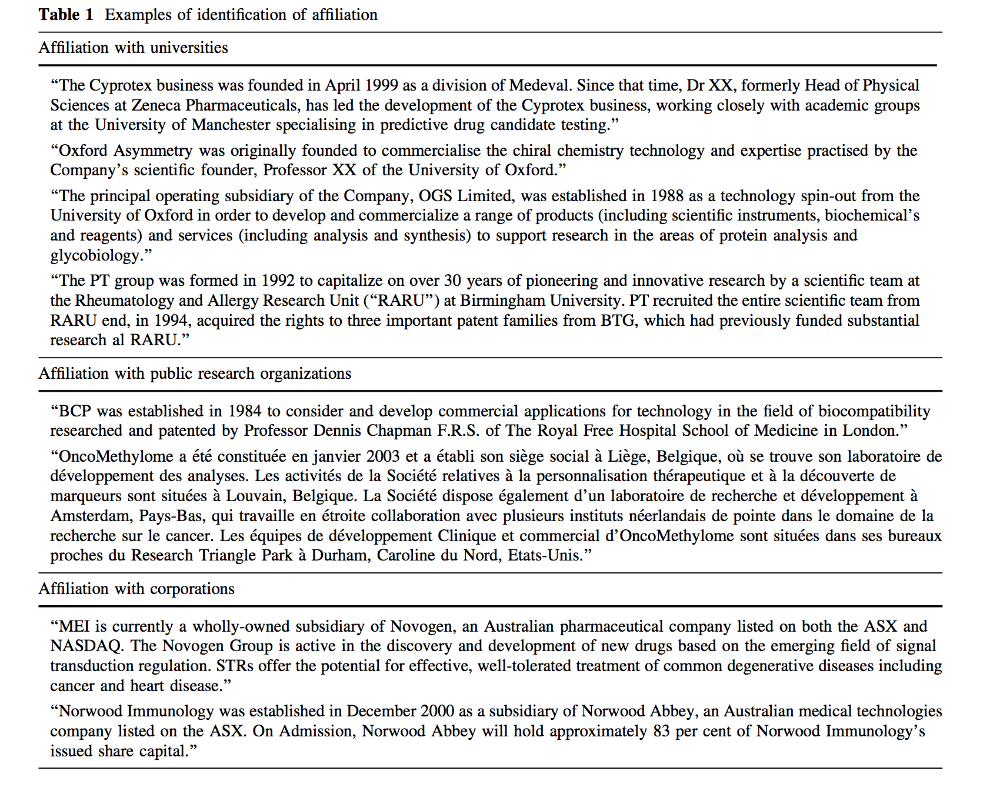
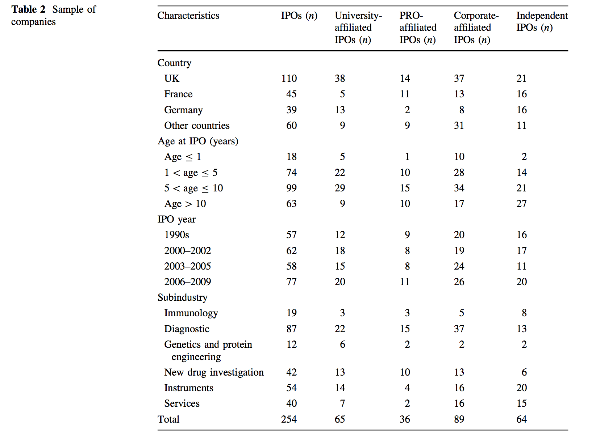
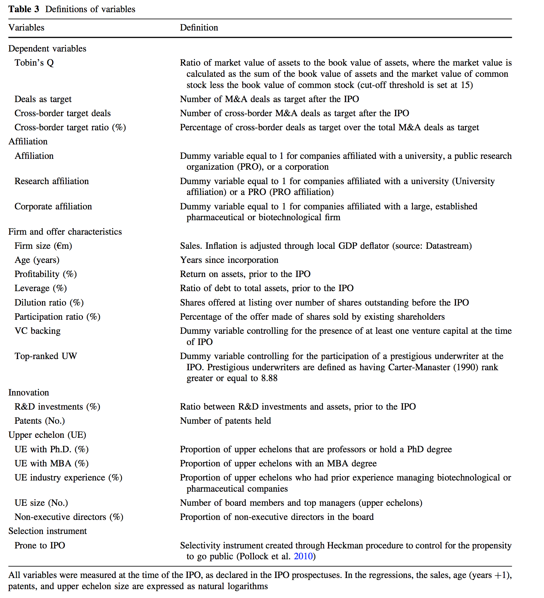
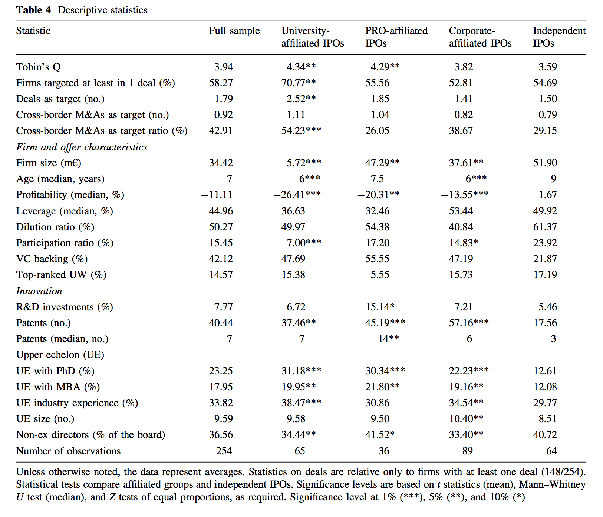
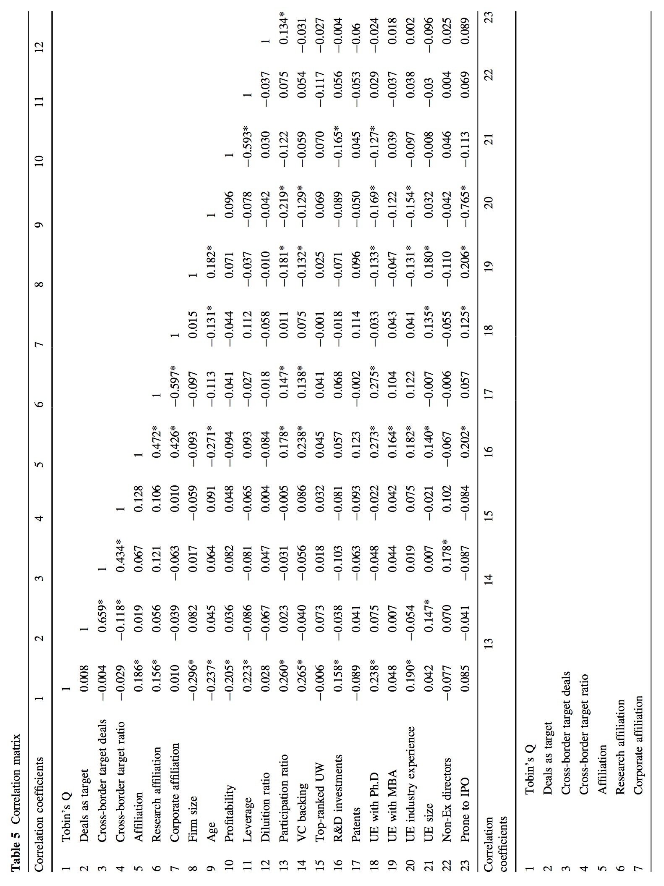
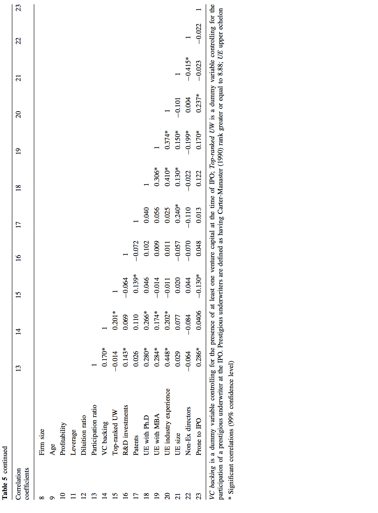
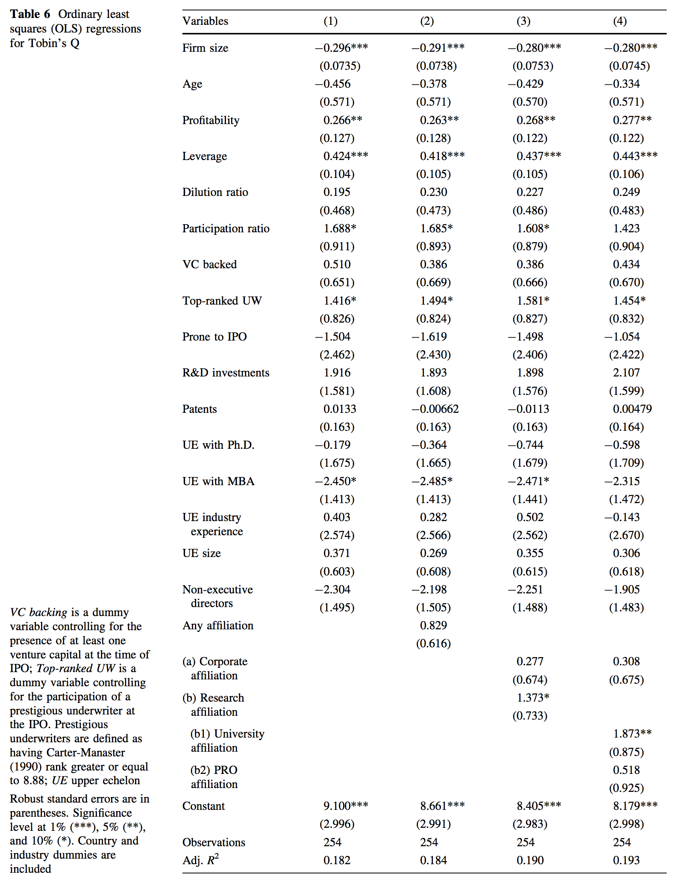
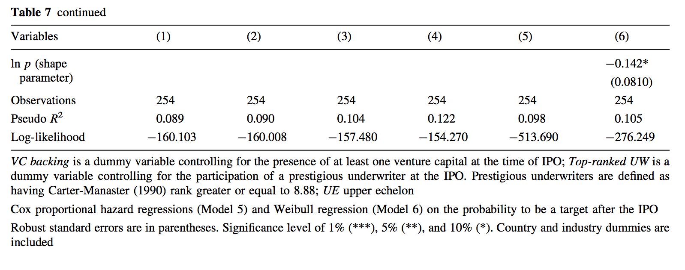
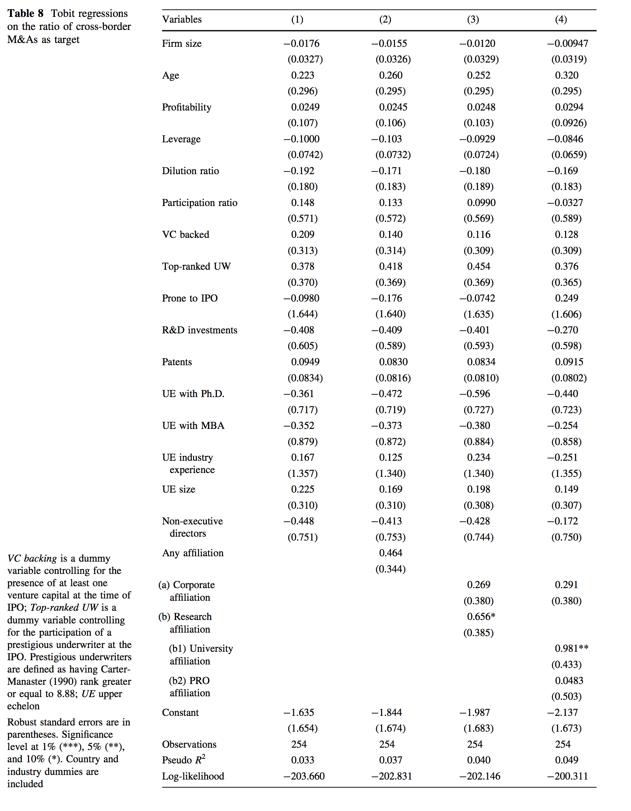
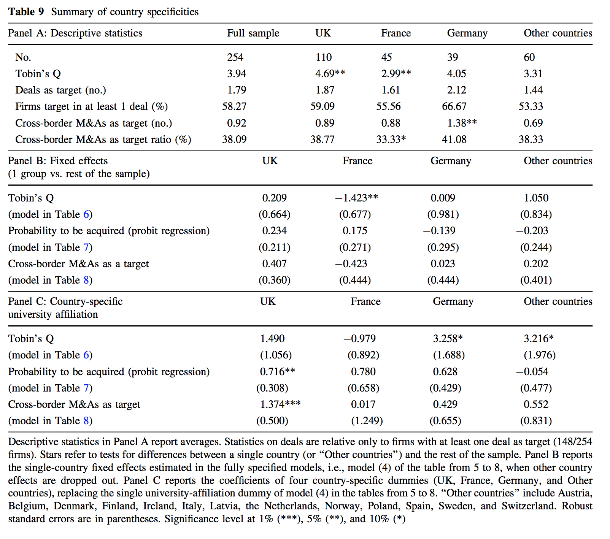

# 完成科技转化过程：科学的 IPO 企业并购

## 摘要

这篇文章研究欧洲1990值2009年期间254个著名生物科技商行的估价和企业并购（M&A）。通过这些，我辨认出很高概率（40%）商行隶属一个大学或是另外一个公共研究组织。考虑到智力一个重要因素和其他可能的决定性因素，我们发现隶属于一个大学是投资者一个优势。这种隶属关系加强了商行的估值和在接下来的企业并购过程中，更有可能会是一个跨国交易。我们总结出：接下来的初始公开收购确认（offer）跟在研究机构开始的科技成果转换有很大关系。我们的调查结果允许我们发现企业投资者的起源，如：学者企业家，大学管理者，政策制定者。

## 简介

大意翻译

基于研究的拆分(spin-offs)并不像其他宏观经济学中的那样，如generate major, short-term shifts。尽管如此，在科技行业他的间接影响还是很大的。因为他们力争发展根本的技术革命，他们产生的社会价值远远超过与他们自己的回报。这样，他们可以集中精力在研究和政策创新上。特别的，从大学和公共研究组织冲拆分收到了越来越多的政策制定者的关注而且一系列的鼓励他们形成和政策的措施已经形成。国家经济对科学企业管理的重要程度接受反映在相关的出版物增加很多。

这篇文章分为5个部分：章节2叙述理论框架，章节3描述我们的实验设计，包裹我们的例子，变量，方法论。章节4提供经济报告。最后章节5讨论我们研究的总结和他的深层分析。

## 理论框架

大意翻译

这篇文章，我们调查是否隶属一个研究院是否会产生影响：1)商行上市时估值，2)他们成为股权交易的目标，3)他是否参与跨国交易。在接下来的几个子章节中会正式确定我们的假设。

### 基于科学的 IPO 估值

假设一个小的生物学商会上市是一个主要任务。这样，一个成功的生物学尝试尽可能快的上市，到他们调查市场时，他们并没有可以展示的足够多的记录。这时候估值对于他们公司来说是个很大的挑战，他们最为核心的象征：知识和技术是很难理解和估值的。

创建者和外部潜在的投资者之间极大的信息不对称导致了市场的失败。市场伙伴不会乐意观察某个项目的投资价值，因此更愿意通过一些可靠的信号来近似信息。IPO 的挑战是吸引和说服更多的潜在投资者我们的公司长期来讲是很有潜力的。另外，成功时传递积极信号的因素。

新上市的企业未来的发展不仅依赖经济，同时也和与创新的创造和管理的智力因素相关。本研究扩展考虑了科学技术的因素，一些文章专门调查了科学技术支持对 IPO 的影响。

我们的工作主要关注隶属于研究机构给市场所带来的信号。特别地，我们认为从其上级研究机构继承而来的公司，上级公司是他们最初的能力支撑，会影响他们接下来的发展。外部观察人员会认为这种隶属关系使该公司有更多接触科学研究和资源的机会。

隶属于某个科研机构的公司通过隶属关系获得了很多可度量和不可度量的好处，可度量的好处比如可以利用大学的实验室和图书馆，不可度量的好处例如可以及时获得技术最新状态。这些因素会增强外部的投资者的信心。所以，我们假设这种隶属关系减少了投资者在合法性上的担心，提高了该公司的吸引力，增强了它的价值。

>**假设1** 隶属于科研机构可以增强一个公司的价值。

我们也承认，隶属于研究机构可能也会存在负面影响。比如，所在的实验室的研究成果并不适合商业化等。

### 公司控制的科学IPO市场

寻找潜在的收购者永远是昂贵的，因为它涉及到获得知名度。使用IPO的顺序剥离策略是很有吸引力的，他可以用于提高公司的资产和减少不确定性。公司的上市增加了商户的发 展水平，使他们更容易获取信息。IPO由公司定价，未来交易量会增长，因为估值对投资者的挑战得以缓解。创始人可以通过在公司上市后采取剥离的策略来最大化其股票，而不 是直接以非流动性（缺乏市场价格）折扣的价格直接销售静止私人企业。这些论点的重要性在知识密集型行业尤其明显，例如生物技术，其中并购谈判往往较长，买家经常提出较 低的出价。此外，对于基于研究的公司，公司对市场的透明度的问题尤其严重。这种情况可能与行业的联系较少，使得投标人不太了解公司的潜力。IPO和并购市场让商户与市场 建立了联系。
第二，所有股权变化的匹配理论有助于解释涉及基于科学的IPO的并购交易。这一理论背后表明并购是公司控制市场的重要机制，因为业务转移促进劳动这一基本资源流动。
第三，联盟文献强调了联盟合作伙伴可以通过组合互补资源和能力实现的互利
在收购方，并购是为现有企业寻求资源战略的可行手段，因为它们允许获得战略性和可能的其他不可市场化的资源，例如通过与研究所的联盟授予的资源。


### 基于科学的IPO的跨境并购

在以复杂和快速扩展的知识库为特征的行业中，创新在于现有企业，新进入者和研究机构组成的网络，而不是在个体企业的这一界限内。网络通过提供对市场交换不容易获得的知 识和资源的访问。在生物技术方面，科学家不仅通过参与国际科学界，还通过提供与大学和其他知识来源的连接，发挥这种边界作用。这种知识的获取在未来可能会更大，因为研 究人员和大脑的国际流动流通正日益成为学术生涯不可或缺的一部分。 在这种形势下，让大家丰富了国际知识，认知整合和技术转让机会。因此，与研究所的合作有望改善企业 的国际曝光率。我们认为，在信号方面，这种观点改善了国际舞台上公司的合法性。在资源方面，有限责任公司有机会获得更高和更国际化的资本。

## 研究设计和方法

像前面提到的那样，IPO 的主要挑战是说服广大投资者该公司拥有良好的长期前景。公司该阶段的主要信息交流公司是提供一个简介。潜在的投资者会小心谨慎地阅读该简介评估公司的前景。要上市的工资需要描述公司发展的历史、重大决定以及高层的人员。我们通过这些环节来识别公司的关键的隶属关系。

依托高校的公司被定义为教师基于自己的研究成果或者以其研究成果为主导技术的公司，这个定义在众多文献中都是一致的。依托 PRO 的公司是指隶属于医院或者政府机构的公司。

### 样本选择和描述

我们学习了从1990到2009年在欧洲上市的生物公司数量。IPO 公司的列表从 EUPIPO 数据库中获取，该数据库提供了欧洲最近已经上市公司的简介了详细信息这种。在这期间，有254家生物科技公司在欧洲上市，大部分是在英国、法国和德国。虽然我们的样本公司都是生物公司，但他们在这个产业中都分别占有一片天地。我们包括了很多假设的变量来表示生物技术不同部分的代表参与者。与文献【】一致，我们使用四个变量来表示新公司是否属于免疫学、诊断学、基因与蛋白工程、或者新药物领域。我们加入了两个新的类别，器械和服务。

样本公司按照隶属形式的不同和按照国家、IPO 的年龄、IPO 的年份以及子产业，如表2描述所示，101（40%）是基于科研的，其中89（35%）是隶属于大型药物公司的。高比例的隶属公司保证了生物行业紧跟科研的步伐。剩余的64家公司（25%）被分为独立的公司。

我们可以预测，英国会主导那110个公司样本。其中52个是基于科研的，这是因为英国是欧洲股票交易发展水平最高，高校企业化程度最高。大多数的样本公司在他们的基础上10年完成上市，其中18家在1年内就完成了。诊断学是上市公司数字中最相关的子产业（87个公司），它包括了大部分隶属大型药物企业（37个公司）。三分之二的基因和蛋白工程公司是基于科研（8/12），其中科研隶属在服务种类公司中频率比较低（9/40）。

### 变量

为了调查初始市场估值的决定因素，我们依赖于Tobin’s Q这一指标，这是一个由投资者市场广泛认可的公司未来增长机会的指标。该研究采取动态的观点，以样本公司的并购活 动为中心。我们确定341个并购交易，我们的样本数据为公司在其IPO之后到2011年3月。就控制而言，它们都是在IPO时测量的，并且分为三类，如表3中详细定义所报告的：（1） 公司和其报价的一般特性，（2） 创新，和（3）上层。 这些变量可能影响公司筹集资本的能力和投资者对公司的看法。 在回归分析中，我们控制所有这些变量的影响。


关于创新活动的数据描述了有限责任公司在产出（专利数量）方面更具创新性，而在资产负债表中显示的研发投资没有明显差异。 上层的背景在收敛和非收敛的公司之间有很大 的不同。 前公司的领导者有较高的教育成就（博士和MBA）。 大学或企业法人员的非执行董事和高级行政人员较少，具有更多的行业经验。


### 方法

我们的第一个实证分析旨在调查研究型公司的市场初始估值的决定因素，依赖于托宾Q的投资者的感知价值。8我们使用OLS回归来模拟收益对初始市场估值的影响，控制智力 资本 和其他可能的决定因素。 在IPO之后作为并购目标的概率通过使用权益模型进行调查。我们还使用Cox比例风险回归，并将结果与通过威布尔比例风险模型获得的结果进行比较， 以便测试是否早期将目标公司 到没有替代品的公司。 最后，为了分析跨国并购交易的相对数量作为目标，我们使用Tobit回归，将因变量处理为0和1之间的审查
因为不是所有的公司都上市，只研究IPO公司可能会引入一个“成功”的假设，可能影响我们的结果。为了解决这个问题，我们设定选择性仪器作为一个控制。与先前对IPO的研究 （例如，Pollock等人，2010）一致，我们采用Heckman程序来创建仪器。首先，我们从范德克的Amadeus数据库获得了1995年至2009年期间没有上市的生物技术公司名单。为了将 治疗单位（IPO公司）与控制单位（私人公司）相匹配，我们首先估计倾向得分，使用最近邻倾向得分。然后，我们执行逻辑回归，其中预测变量是企业规模（收入）和年龄（基 础年）和国家虚拟。这种回归被用于创建选择性仪器，其被包括在我们的模型中的基线回归中。

## 经济学结论

在本节中，我们将报告对第2节中的经验进行验证的结果。

### 基于科研的 IPO 的苹果

表6中的回归结果证实了我们的假设。隶属于一个高校时刻一个有效增强要上市公司的价值。所以，高校依托成为投资者的一个考虑因素是非常有道理的。通过控制变量法，我们发现更小、收益更高的和受益更高的公司会有更高的估值，可能因为他们表现出更大的发展机遇。

### 科学公司 IPO 的公司控制的市场

典型的依托高校建立的公司对潜在的投资者更具吸引力。如表7所示假设2被证实。的确，依托高校会增加公司被知道的概率。

### 基于科学 IPO的跨国企业估价和并购

依托高校的企业更加容易出现在跨国交易中如表8所示，因此我们正式了假设3：依托高校可以提升一个公司的国际曝光率和可信度。

### 国家特征

在之前的回归中，我们都没有考虑国家因素，在表9中，我们分析了国家特征。表 A 中，我们展示了国家的描述性数据，表 B 中，我们展示了在前面的回归中国家的影响，没有明显的影响。表 C 中，我们报告了一个关于高校依托具体的国家的影响，德国在 Tobin's Q 上有更大的影响，而英国则在 M&A上有更大的影响。

## 结论

本文章学习了机构隶属关系在自1990年以来欧洲的上市生物技术公司的影响。主要发现是隶属于高校会影响公司的发展。首先，隶属关系被认为有利于投资者。其次，依托高校的公司更可能成为成为随后M&A 的目标公司。第三，隶属于公司加速了公司的国际化，更容易成为跨国交易的目标公司。

本研究研究了基于科学的企业和金融市场之间的相关性。这些结论会是投资天使和风险投资人很感兴趣的。我们的发现给现实中基于科学的企业提供了管理上有用的可实施的方案。首先，公司上市使他们有机会能让资本回收。这个事实对于依托高校的公司更是正确，当他们上市他们享有很高的资本回收比例；齐次，企业可以考虑进入"资本市场"。他们的公司对于亟待利用技术和学术发展的大型公司，根据我们的调查研究，公司的任职者对他们的公司是很感兴趣的。

更进一步说，这篇论文在科学企业化的过程中：高校的管理者、PROs，TTOs，孵化器管理者以及政策制定者。一个活跃的 M&A市场是促成科技和金融有效的方式。依托高校建立的公司在 M&A 交易过程中是引起投资人的广泛关注。所以，TTO 员工和孵化器管理者应该在帮助基于科研的公司成为更加吸引人的认知目标。

在这个领域存在一些确定的开展更深入研究的机会。首先，在成功的基于科学的公司可以通过 IPO 和随后的认知完成他们的技术转换阶段。其次，很多关于新生物公司的研究都关注在美国，而我们关注于欧洲，这扩大了我们的视野，允许我们从更多的样本中获得启示，进行上市。第三，关于企业生命周期的研究强调高层管理在风险投资时有不同的目的，更深入的研究可以通过调查在公司中任职并且在 IPO 中优先或者后来加入的个人科学家从而进行研究。

